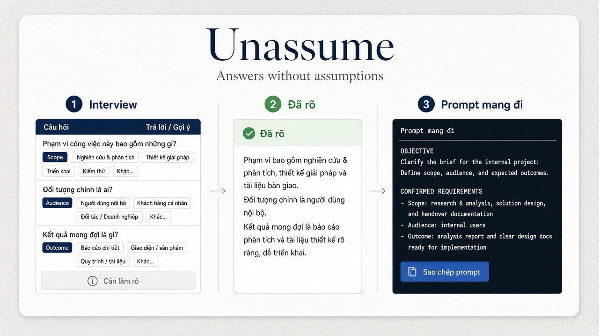

# Unassume

**Answers without assumptions.**

Unassume is a local-first brief clarifier for LLM work. It interviews for missing requirements, scores **CLEAR** with deterministic rules (not model vibes), answers from confirmed facts only, and exports a **portable prompt** you can paste into any other AI agent.

> Most tools wrap a model and hope. Unassume clarifies the brief first — then generates.

[Architecture](docs/ARCHITECTURE.md) · [SPEC](docs/SPEC.md) · [Portable prompt schema](schemas/portable-prompt.schema.json) · [Benchmark](benchmark/BENCHMARK.md)

[](https://github.com/huytr91/unassume/actions/workflows/gold.yml)




---

## Why Unassume?

| Typical LLM chat | Unassume |
| --- | --- |
| Assumes missing requirements | Asks meta brief questions first |
| Jumps straight to generate | Local packs + CLEAR gate before answer |
| One opaque reply | Answer **+** one-click portable prompt |
| Cloud memory / training risk | Personal hints stay on **this device** |

Unassume is **not** an agent builder (compare Dify / Crew). It is the **clarify → verified brief** layer you run *before* agents execute.

---

## Features

- **Clarify-before-generate ladder** — classify → domain packs → personal ★ options → Call A (meta only) → filter → CLEAR → answer
- **Domain packs** — coding, data, business ops, research / growth (Vietnamese + English templates)
- **CLEAR scorer** — model-independent; vague answers (`ok` / `tùy`) rejected; regression suite via `npm run test:gold`
- **Anti subject-matter quiz** — Call A cannot quiz domain knowledge; allowlisted brief slots only
- **Always deliver** — useful framework with stated assumptions; never refusal-only dead ends
- **Portable prompt** — copy-once downstream brief; machine-readable schema + passthrough labels (`VERIFIED` / `UNVERIFIED_PARTIAL`)
- **BYOK providers** — OpenRouter, OpenAI, Anthropic, Google, DeepSeek, Qwen, Kimi, Ollama
- **On-device personal memory** — frequent choices boosted as ★; no cloud telemetry

---

## How it works

```text
Free-form request
    → Interview (local packs first)
    → Declare structure (user-confirmed facts)
    → Prompt compiler (portable brief)
    → Model answer (confirmed facts only)
    → Optional: copy brief → any other agent
```

---

## Quick start

**Requirements:** Node.js 20+

```bash
cd web
npm install
npm run dev
```

Open [http://127.0.0.1:3500](http://127.0.0.1:3500), connect a provider (bring your own key), describe what you need.

### Tests

```bash
cd web
npm run test:gold      # CLEAR / plan / anti-quiz regression (CI)
npm run test:compare   # offline Unassume vs raw side-by-side for human judging
```

---

## Integrate as a layer

Downstream agents can consume Unassume’s portable brief:

- Schema: [`schemas/portable-prompt.schema.json`](schemas/portable-prompt.schema.json)
- Examples: [`schemas/examples/`](schemas/examples/)
  - `portable-prompt.verified.json` — CLEAR path (`label: VERIFIED`)
  - `portable-prompt.passthrough.json` — early proceed (`label: UNVERIFIED_PARTIAL` + `passthrough.warning`)

---

## Benchmark (maintainer-seeded)

See [`benchmark/BENCHMARK.md`](benchmark/BENCHMARK.md). Seed batch **B01–B28** is labeled `seeded_by: maintainer`. Community cases welcome via the **Benchmark case** issue template.

---

## Privacy

- API keys stay in the browser (optional “remember”) — **not** written into the repository or a server database
- Personal RAG / ★ hints use `localStorage` on this device only
- No cloud telemetry for product training

---

## Project layout

```text
web/                 Vite + React UI and local API (port 3500)
  server/rag/        Ontology, packs, CLEAR, Call A policy, gold set, compare harness
docs/                Architecture and normative SPEC
schemas/             Interview + portable prompt JSON Schemas
benchmark/           Maintainer-seeded cases + human rubric
```

---

## Docs

- [Architecture](docs/ARCHITECTURE.md) — ontology, packs, CLEAR, Call A, portable prompt policy
- [SPEC](docs/SPEC.md) — gate semantics (CLEAR before execute)

---

## Contributing

Issues and PRs are welcome. Before opening a PR:

```bash
cd web
npm run test:gold
npm run test:compare
npm run build
```

---

## License

[MIT](LICENSE)
